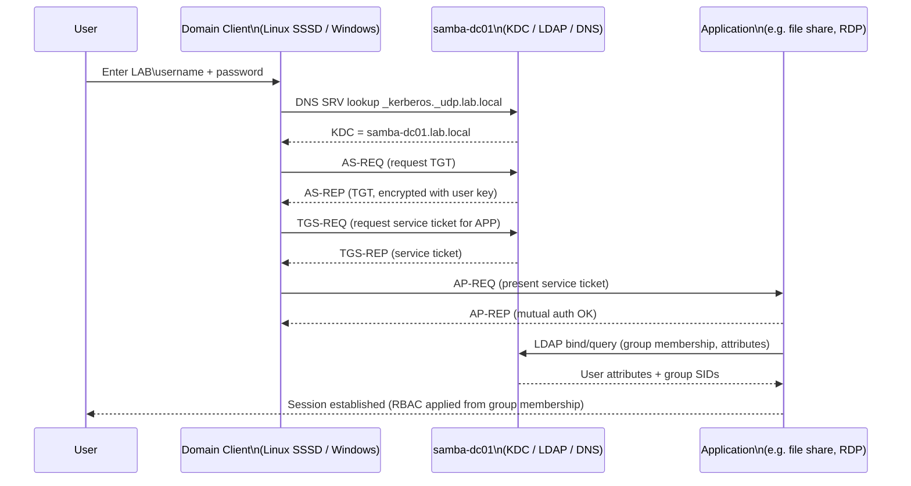

# Authentication Flow (Kerberos / LDAP)

Domain members (Linux via SSSD, Windows natively) authenticate directly against Samba AD using
Kerberos for interactive/service logon and LDAP for identity lookups. Authentik federates the
same directory for web applications rather than maintaining a separate user store.

## Notes

- Linux clients resolve the realm via SSSD (`sssd.conf`, see
  [samba/templates](../samba/templates)) using `krb5` + `ldap` providers against `samba-dc01`.
- Windows clients use the native Kerberos SSO stack once domain-joined; no additional
  configuration is required beyond DNS pointing at `10.10.0.10`.
- Service accounts (e.g. Authentik's LDAP bind account) use a dedicated low-privilege account
  (`svc-authentik`) rather than `administrator`, per least-privilege ([Security.md](../docs/Security.md)).
- Ticket lifetime and renewal policy are set via `samba-tool domain passwordsettings` and
  `msDS-*` attributes — see [SambaAdmin.md](../docs/SambaAdmin.md).
