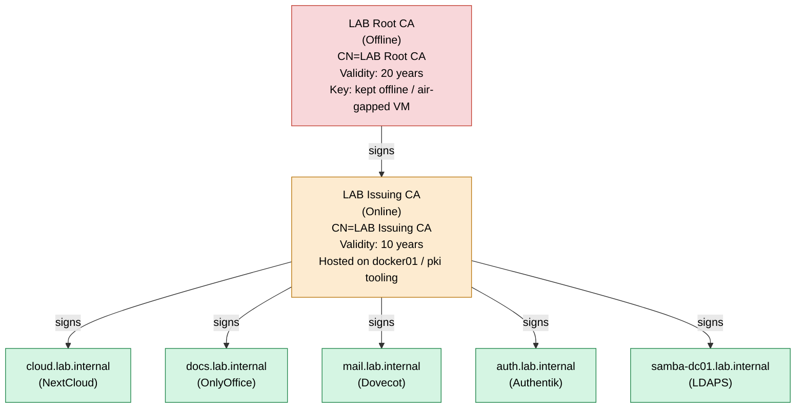
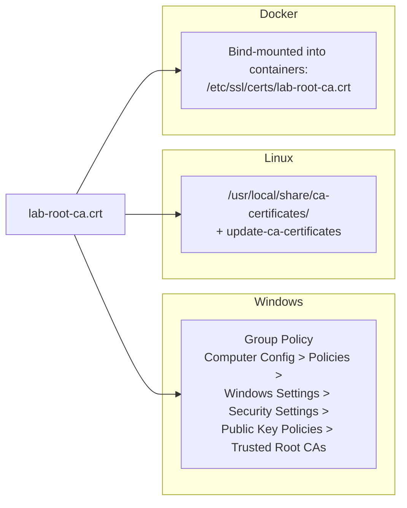

# Certificate Trust Chain

A two-tier internal PKI is used: an **offline Root CA** that only ever signs the Intermediate
CA's certificate and CRL, and an **online Issuing CA** that signs all leaf/server certificates.
This mirrors enterprise practice and lets the Root CA's private key remain offline (exported to
removable media after each Intermediate operation) for the lifetime of the lab.

## Trust distribution

Both the Root CA certificate and the Issuing CA certificate are distributed to trust stores
(the full chain), while only the Root CA certificate is marked as a **trust anchor**. See
[PKI.md](../docs/PKI.md) for the full certificate lifecycle and distribution automation
(`pki/scripts/`, `pki/gpo/deploy-root-ca.ps1`, `ansible/roles/pki_trust`).
