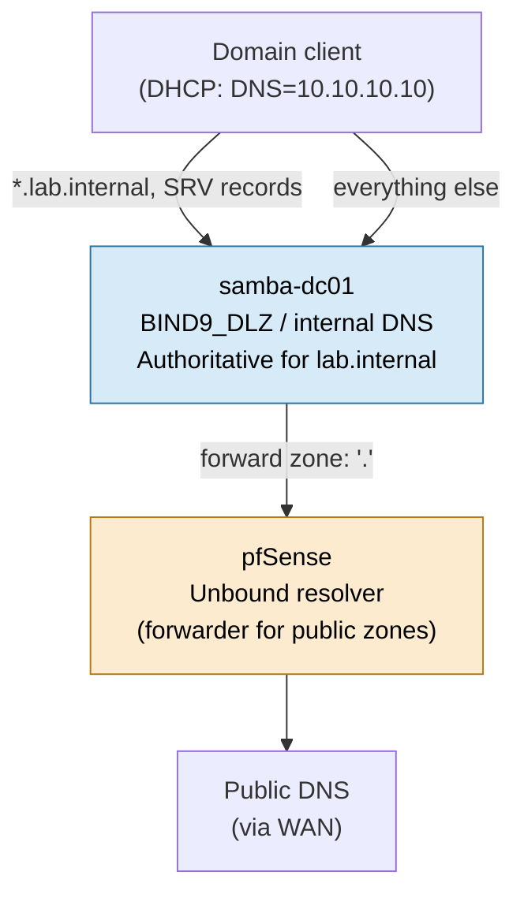

# DNS Architecture

Samba AD's internal DNS server is authoritative for `lab.internal` and is the only DNS server
handed out to LAN clients (via pfSense DHCP option 6). pfSense forwards non-`lab.internal`
queries upstream so domain members still resolve public/internet names. No client is ever
pointed directly at a public resolver — this keeps SRV record discovery for Kerberos/LDAP
working correctly.

## Zone contents (`lab.internal`)

| Record type | Name                          | Value                         | Purpose                                   |
| ----------- | ----------------------------- | ----------------------------- | ----------------------------------------- |
| A           | `samba-dc01.lab.internal`     | `10.10.10.10`                 | Domain controller                         |
| A           | `docker01.lab.internal`       | `10.10.10.20`                 | Docker application host                   |
| A           | `authentik01.lab.internal`    | `10.10.10.30`                 | Authentik IAM                             |
| CNAME       | `cloud.lab.internal`          | `docker01.lab.internal`       | NextCloud (via reverse proxy)             |
| CNAME       | `docs.lab.internal`           | `docker01.lab.internal`       | OnlyOffice (via reverse proxy)            |
| CNAME       | `mail.lab.internal`           | `docker01.lab.internal`       | Dovecot IMAP + Postfix submission         |
| CNAME       | `auth.lab.internal`           | `authentik01.lab.internal`    | Authentik                                 |
| CNAME       | `www.lab.internal`            | `docker01.lab.internal`       | WordPress                                 |
| CNAME       | `pdf.lab.internal`            | `docker01.lab.internal`       | Stirling PDF (forward-auth via Authentik) |
| CNAME       | `autoconfig.lab.internal`     | `docker01.lab.internal`       | Betterbird account autoconfig             |
| SRV         | `_kerberos._udp.lab.internal` | `samba-dc01.lab.internal:88`  | KDC discovery                             |
| SRV         | `_ldap._tcp.lab.internal`     | `samba-dc01.lab.internal:389` | LDAP discovery                            |

DNS forwarding from Samba's internal DNS to pfSense's Unbound resolver is configured via the
`dns forwarder` setting in `smb.conf` (see
[samba/templates/smb.conf.j2](../samba/templates/smb.conf.j2)). Reverse-proxy hostnames
(`cloud`, `docs`, `mail`, `auth`, `www`, `pdf`, `autoconfig`) all resolve internally — there is
no public DNS exposure by design, since this is an isolated homelab, not an internet-facing
deployment.

For multi-business setups, see [diagrams/federation-topology.md](federation-topology.md) —
each business keeps this same zone structure independently, under its own domain.
