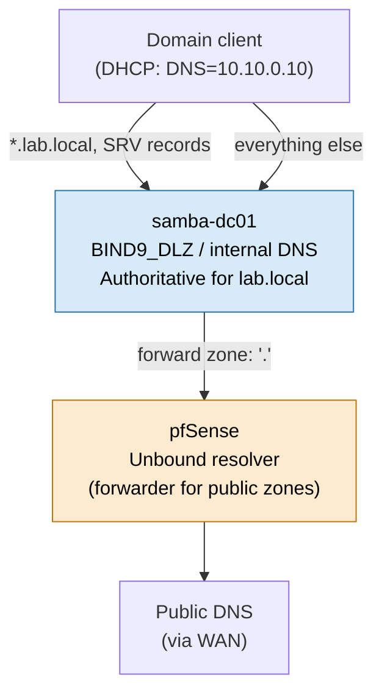

# DNS Architecture

Samba AD's internal DNS server is authoritative for `lab.local` and is the only DNS server
handed out to LAN clients (via pfSense DHCP option 6). pfSense forwards non-`lab.local`
queries upstream so domain members still resolve public/internet names. No client is ever
pointed directly at a public resolver — this keeps SRV record discovery for Kerberos/LDAP
working correctly.

## Zone contents (`lab.local`)

| Record type | Name                       | Value                      | Purpose                        |
| ----------- | -------------------------- | -------------------------- | ------------------------------ |
| A           | `samba-dc01.lab.local`     | `10.10.0.10`               | Domain controller              |
| A           | `docker01.lab.local`       | `10.10.0.20`               | Docker application host        |
| A           | `authentik01.lab.local`    | `10.10.0.30`               | Authentik IAM                  |
| CNAME       | `cloud.lab.local`          | `docker01.lab.local`       | NextCloud (via reverse proxy)  |
| CNAME       | `docs.lab.local`           | `docker01.lab.local`       | OnlyOffice (via reverse proxy) |
| CNAME       | `mail.lab.local`           | `docker01.lab.local`       | Dovecot IMAP                   |
| CNAME       | `auth.lab.local`           | `authentik01.lab.local`    | Authentik                      |
| SRV         | `_kerberos._udp.lab.local` | `samba-dc01.lab.local:88`  | KDC discovery                  |
| SRV         | `_ldap._tcp.lab.local`     | `samba-dc01.lab.local:389` | LDAP discovery                 |

DNS forwarding from Samba's internal DNS to pfSense's Unbound resolver is configured via the
`dns forwarder` setting in `smb.conf` (see
[samba/templates/smb.conf.j2](../samba/templates/smb.conf.j2)). Reverse-proxy hostnames
(`cloud`, `docs`, `mail`, `auth`) all resolve internally — there is no public DNS exposure by
design, since this is an isolated homelab, not an internet-facing deployment.
