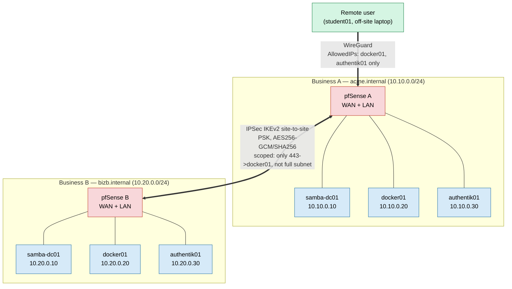

# Federation Topology (Multi-Business)

See [docs/MultiBusiness.md](../docs/MultiBusiness.md) for the full workflow. This diagram
shows two independently-deployed businesses bridged by an IPSec site-to-site tunnel, plus a
remote user reaching one business over WireGuard — both mechanisms scoped to specific
hosts/ports rather than full subnet trust.

## What crosses the tunnel vs. what doesn't

| Crosses the IPSec tunnel | Does not cross |
|---|---|
| Packets to the specific host:port pairs each side's scoped firewall rule allows (see [MultiBusiness.md#scoped-firewall-rules-not-full-subnet-trust](../docs/MultiBusiness.md#scoped-firewall-rules-not-full-subnet-trust)) | PKI trust — each business keeps its own Root/Issuing CA; the other side's certs show as untrusted until deliberately imported |
| — | AD/Kerberos federation — Business A's Authentik does not federate Business B's Samba AD |
| — | DNS — each business's DNS remains authoritative only for its own domain; there is no shared resolution unless [LabInternet.md](../docs/LabInternet.md) is layered on top |

This gap between "network reachable" and "trusted/federated" is intentional and is the
teaching point of [docs/MultiBusiness.md](../docs/MultiBusiness.md) — closing that gap
deliberately, rather than by default, is what [docs/LabInternet.md](../docs/LabInternet.md)
is for.
