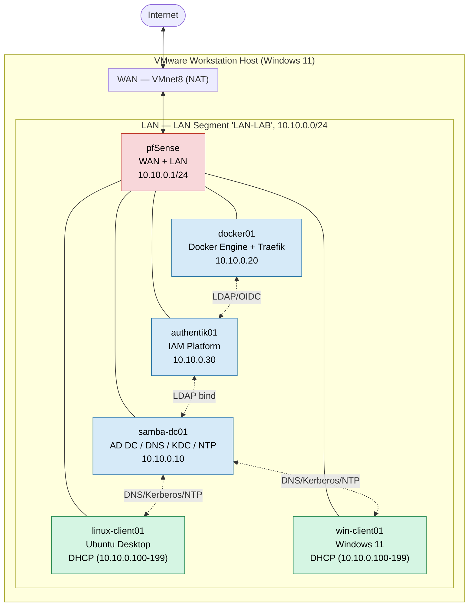

# Network Topology

VMware Workstation hosts two virtual networks: pfSense's WAN leg on the built-in **NAT**
network (`VMnet8`) and a **LAN Segment** named `LAN-LAB` (`10.10.0.0/24`) that carries all lab
traffic. pfSense is the only VM with a leg on both networks and is the default gateway, DHCP
relay point, and firewall for the LAN.

## Addressing plan

| Host           | Role                                      | Address                |
| -------------- | ----------------------------------------- | ---------------------- |
| pfSense (LAN)  | Gateway / Firewall / DHCP / DNS forwarder | `10.10.0.1/24`         |
| samba-dc01     | AD DC, LDAP, Kerberos, DNS, NTP           | `10.10.0.10`           |
| docker01       | Docker Engine, reverse proxy, apps        | `10.10.0.20`           |
| authentik01    | Authentik IAM (bare host or VM)           | `10.10.0.30`           |
| linux-client01 | Ubuntu Desktop, SSSD domain member        | DHCP `10.10.0.100-199` |
| win-client01   | Windows 11, domain member                 | DHCP `10.10.0.100-199` |

DHCP pool `10.10.0.100–10.10.0.199` is served by pfSense; DHCP option 6 (DNS) points clients
at `10.10.0.10` so domain-joined machines resolve `lab.internal` correctly. See
[dns-architecture.md](dns-architecture.md) for resolution details.
