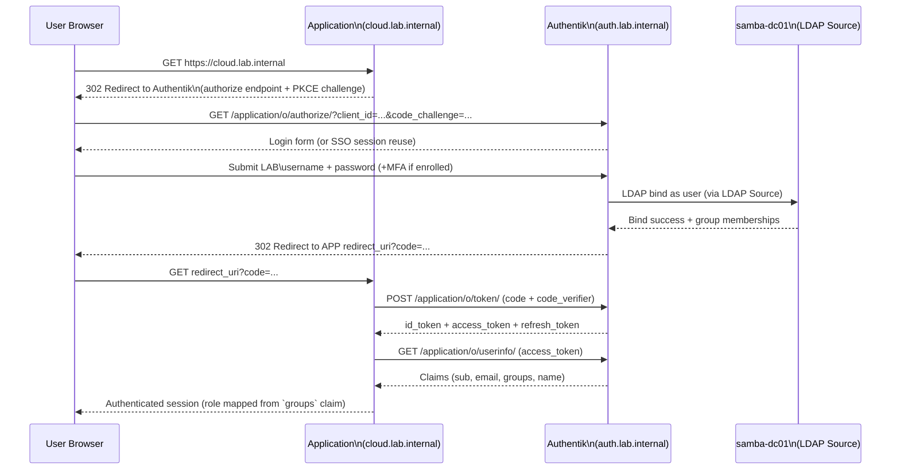

# OIDC Authentication Flow (Authentik → Application)

Applications that support OpenID Connect (NextCloud, and Authentik's own admin/user portal)
delegate authentication to Authentik using the Authorization Code flow with PKCE. Authentik in
turn resolves the user's identity from Samba AD via its LDAP source, so there is a single
source of truth for identity even though two protocols (Kerberos/LDAP and OIDC) are in play.

## Claim / group mapping

| Authentik Group | OIDC `groups` claim value | Application role mapping         |
| --------------- | ------------------------- | -------------------------------- |
| IT-Admins       | `IT-Admins`               | NextCloud admin, Authentik admin |
| Docker-Admins   | `Docker-Admins`           | Traefik dashboard, Portainer     |
| Lecturers       | `Lecturers`               | NextCloud group folder owner     |
| Students        | `Students`                | NextCloud standard user          |

Group sync from Samba AD into Authentik is configured in
[authentik/blueprints/ldap-source.yaml](../authentik/blueprints/ldap-source.yaml); the OIDC
providers and scope/claim mappings are in
[authentik/blueprints/oidc-nextcloud.yaml](../authentik/blueprints/oidc-nextcloud.yaml) and
[authentik/blueprints/oidc-onlyoffice.yaml](../authentik/blueprints/oidc-onlyoffice.yaml).
