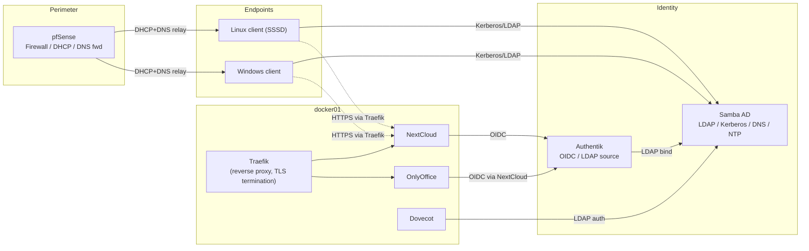

# Architecture

## Purpose

This repository defines a self-contained, IaC-driven homelab that simulates a small
organisation's IT estate: perimeter firewall, Active Directory, identity federation, a Docker
application platform, and both Windows and Linux endpoints. It exists to teach realistic
sysadmin/DevOps workflows — domain administration, PKI, IAM/SSO, reverse proxying,
containerised applications — end to end, on a single VMware Workstation host.

## Component inventory

| Component         | VM/Host          | IP           | Role                                                                 |
| ----------------- | ---------------- | ------------ | -------------------------------------------------------------------- |
| pfSense           | `pfsense01`      | `10.10.0.1`  | Perimeter firewall, DHCP, NAT, Unbound DNS forwarder                 |
| Samba AD DC       | `samba-dc01`     | `10.10.0.10` | AD DC, LDAP, Kerberos KDC, internal DNS, NTP                         |
| Docker App Server | `docker01`       | `10.10.0.20` | Docker Engine, Traefik reverse proxy, NextCloud, OnlyOffice, Dovecot |
| Authentik         | `authentik01`    | `10.10.0.30` | IAM/SSO — LDAP source + OIDC provider                                |
| Linux Desktop     | `linux-client01` | DHCP         | Ubuntu Desktop, SSSD domain member                                   |
| Windows Desktop   | `win-client01`   | DHCP         | Windows 11, native AD domain member                                  |

See [network-topology.md](../diagrams/network-topology.md) for the full network diagram.

## Design principles

1. **Everything reproducible.** Every VM's post-install state is reached by running a script
   or Ansible playbook against a stock OS install — nothing depends on manual GUI clicks beyond
   the minimum VMware Workstation / pfSense / Windows steps that have no scriptable equivalent.
2. **Single source of identity.** Samba AD is the only identity store. SSH/console logons
   (Linux via SSSD, Windows natively) and web application logons (via Authentik's LDAP source)
   both resolve to the same AD accounts and groups — there is no parallel user database.
3. **Least privilege by default.** Service accounts (`svc-authentik`, `svc-nextcloud`, ...) are
   distinct from human accounts, and are member of scoped groups, not `Domain Admins`. See
   [Security.md](Security.md).
4. **PKI-backed trust everywhere.** All internal HTTPS endpoints and LDAPS use certificates
   issued by the lab's own two-tier CA, distributed automatically (GPO on Windows,
   `update-ca-certificates` on Linux, bind-mounts in Docker). See [PKI.md](PKI.md).
5. **Config as code.** pfSense config (`config.xml`), Samba provisioning, Authentik blueprints,
   and all application stacks are version-controlled templates rendered by scripts/Ansible, not
   hand-edited running state.

## Component interaction overview



## Data flow summary

- **Authentication:** endpoints authenticate to Samba AD via Kerberos/LDAP
  ([auth-flow.md](../diagrams/auth-flow.md)); web apps authenticate via Authentik's OIDC layer,
  which itself resolves users from Samba AD over LDAP
  ([oidc-flow.md](../diagrams/oidc-flow.md)).
- **Name resolution:** all lab hosts use Samba AD as their DNS server; pfSense's Unbound
  instance is the only upstream forwarder ([dns-architecture.md](../diagrams/dns-architecture.md)).
- **Trust:** a two-tier internal CA (offline Root + online Issuing CA) issues all service
  certificates; trust is pushed to Windows via GPO, Linux via `update-ca-certificates`, and
  Docker via bind-mounted CA bundles ([cert-trust-chain.md](../diagrams/cert-trust-chain.md)).

## Repository layout

```text
repo-root/
├── docs/           Architecture, deployment, admin, and student documentation
├── diagrams/        Mermaid source for all architecture diagrams
├── workstation/     VMware Workstation VM inventory, network config, provisioning notes
├── pfsense/         pfSense config.xml template + post-install hardening script
├── samba/           samba-tool automation: AD provisioning, users, groups, OUs, backup
├── pki/             Two-tier internal CA: root/intermediate init, issuance, renewal, revocation
├── docker/          Docker Compose stacks: reverse proxy, Authentik, NextCloud, OnlyOffice, mail
├── authentik/       Authentik blueprints (LDAP source, OIDC providers, groups, MFA) + bootstrap
├── ansible/         Playbooks and roles that tie every component together
├── scripts/         Top-level orchestration entry points (deploy-all.sh, issue-cert.sh, ...)
└── templates/       Shared Jinja2 templates (motd, hosts, resolv.conf)
```

## Trade-offs and scope

- **pfSense is not Ansible-managed.** pfSense's config is XML-based and its package ecosystem
  doesn't lend itself to idempotent CLI automation the way Linux does. Instead we ship a
  reviewed `config.xml` template (imported once via the GUI/`pfSsh.php`) plus a post-install
  shell script for anything better done over SSH. See [pfsense/README.md](../pfsense/README.md).
- **Authentik is deployed as a Docker Compose stack**, not bare-metal, even though the network
  diagram gives it its own IP (`10.10.0.30`) — it runs as its own Compose project on a
  dedicated VM so that the identity plane's failure domain is isolated from the application
  plane on `docker01`.
- **Root CA is "offline" in spirit, not physically air-gapped**, since this is a single-host
  lab. The automation still enforces the operational separation (Root CA key material is
  generated once, used to sign only the Intermediate CA cert + CRLs, and is never referenced by
  the day-to-day issuance scripts) so the workflow teaches the real pattern.
