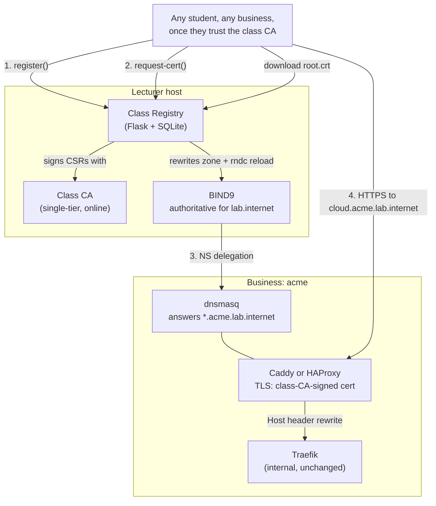

# Class Registry

> **Optional, advanced.** This entire document describes a layer on top of the base lab. A
> single business deployment ([docs/DeploymentGuide.md](DeploymentGuide.md)) never needs any of
> this — it exists for a classroom running multiple businesses that want to be reachable from
> each other with real, working DNS delegation and trusted HTTPS, without merging identities or
> networks. See [docs/MultiBusiness.md](MultiBusiness.md) for the lighter-weight
> peer-to-peer alternative (IPSec/VPN, no shared CA or DNS) if that's all you need.

## What this gives you that MultiBusiness.md doesn't

[MultiBusiness.md](MultiBusiness.md) connects exactly two businesses at a time, peer-to-peer,
with no shared naming or trust. The Class Registry instead gives an entire classroom:

- **One shared root domain** (`lab.internet`) with each business as a subdomain
  (`acme.lab.internet`), registered and NS-delegated through a real DNS zone — not a manual
  hosts-file hack.
- **One shared CA** ("the class CA") that signs each business's edge-proxy certificate, so any
  student who trusts that one CA sees valid HTTPS for _every_ registered business, with no
  per-pair cert exchange.
- **A live, visual directory** of who's registered, at a glance — the registry's homepage table
  - diagram.

It does **not** give businesses a shared AD/Authentik identity, and it does not by itself give
network reachability between businesses — see [MultiBusiness.md](MultiBusiness.md) for that (a
registered, DNS-resolvable, HTTPS-trusted business is not automatically network-reachable; you
still need your own routing/firewall/port-forwards, same as any internet-facing service).

## Architecture



## End-to-end workflow

**Lecturer, once:**

```bash
cd federation/class-registry
./scripts/init-registry.sh --ns-ip <this-host's-reachable-IP>
docker compose up -d
```

Give students the registry URL and the printed `CLASS_REGISTRY_TOKEN`.

**Each business:**

```bash
# 1. Register your name/subnet/edge IP
./federation/scripts/register-with-class.sh --registry http://<lecturer-ip>:8080 \
  --token <token> --name acme --subnet 10.20.0.0/24 --edge-ip <your-edge-ip>

# 2. Get your edge cert signed (key generated and stays local)
./federation/scripts/request-class-cert.sh --registry http://<lecturer-ip>:8080 \
  --token <token> --name acme

# 3. Trust the class CA (so YOU see other businesses' HTTPS as valid too)
sudo ./federation/scripts/deploy-class-ca-trust.sh --registry http://<lecturer-ip>:8080
```

Then stand up [`federation/edge-proxy/`](../federation/edge-proxy/) — `dnsmasq/` plus either
`caddy/` or `haproxy-pfsense/` — see that directory's README for the setup order and required
pfSense port-forwards.

## PKI design

The class CA ([`federation/class-registry/ca/`](../federation/class-registry/ca/)) is
deliberately a **single tier**, not the base repo's two-tier Root+Issuing pattern
([docs/PKI.md](PKI.md)) — simpler, and its blast radius is scoped to just the federation
layer's edge-proxy certs, never any business's own internal PKI/AD. The trade-off worth
understanding: unlike every business's own Root CA (which goes offline after bootstrap), the
class CA's private key **must stay online** in the registry container so it can sign CSRs
on-demand throughout a course. This is documented, not hidden, in
[`ca/init-class-ca.sh`](../federation/class-registry/ca/init-class-ca.sh)'s output — destroy
the key at course end.

Each business still generates its own edge-proxy keypair locally
([`request-class-cert.sh`](../federation/scripts/request-class-cert.sh)) and only ever uploads
the CSR — the private key never touches the registry.

## DNS design

The registry manages a single BIND9-served zone (`lab.internet`) using the standard real-world
NS delegation pattern: each business gets an in-bailiwick nameserver
(`ns.<name>.lab.internet`) glued to their `edge_ip`, and the class root zone just holds an
`NS` + `A` (glue) record pair — it never needs to know about any subdomain the business
creates underneath. The business's own `dnsmasq`
([`federation/edge-proxy/dnsmasq/`](../federation/edge-proxy/dnsmasq/)) then authoritatively
answers _everything_ under `<name>.lab.internet` with a single wildcard `address=` rule,
pointed at the same edge IP that terminates HTTPS — no per-service DNS updates needed as a
business adds more exposed hostnames.

The zone file is rewritten and `rndc reload`-ed on every registration
([`app/app.py`](../federation/class-registry/app/app.py)'s `regenerate_zone_file()`) — read it
directly (`federation/class-registry/bind/zones/db.lab.internet`) to see exactly what real BIND
zone delegation looks like, generated from a live database rather than hand-edited.

## Security considerations

- The registration token (`CLASS_REGISTRY_TOKEN`) is the only thing standing between "anyone
  who can reach the registry" and "can register a business / get a cert signed." Treat it like
  any shared classroom secret — rotate it between course offerings, don't commit it anywhere.
- The registry validates subnet non-overlap and name uniqueness server-side (not just
  client-side) before writing to the zone or signing anything — see `register()` in `app.py`.
- Signed certs are strictly scoped: `<name>.lab.internet` and `*.<name>.lab.internet` only,
  computed server-side from the registered name — a business cannot request a cert for anyone
  else's subdomain, since the CSR's requested CN/SAN is ignored in favour of a
  server-constructed SAN.

## See also

- [docs/MultiBusiness.md](MultiBusiness.md) — the lighter-weight, no-shared-infrastructure
  alternative for connecting exactly two businesses.
- [docs/LabInternet.md](LabInternet.md) — the original, larger design this feature grew out of
  (full Issuing-CA cross-signing per business); superseded for most purposes by the simpler
  single-CA-signs-edge-certs approach here, but still the reference if you need every
  business's _entire_ PKI to chain to one root rather than just their edge-proxy certs.
- [federation/edge-proxy/README.md](../federation/edge-proxy/README.md) — the Caddy/HAProxy +
  dnsmasq setup referenced above.
