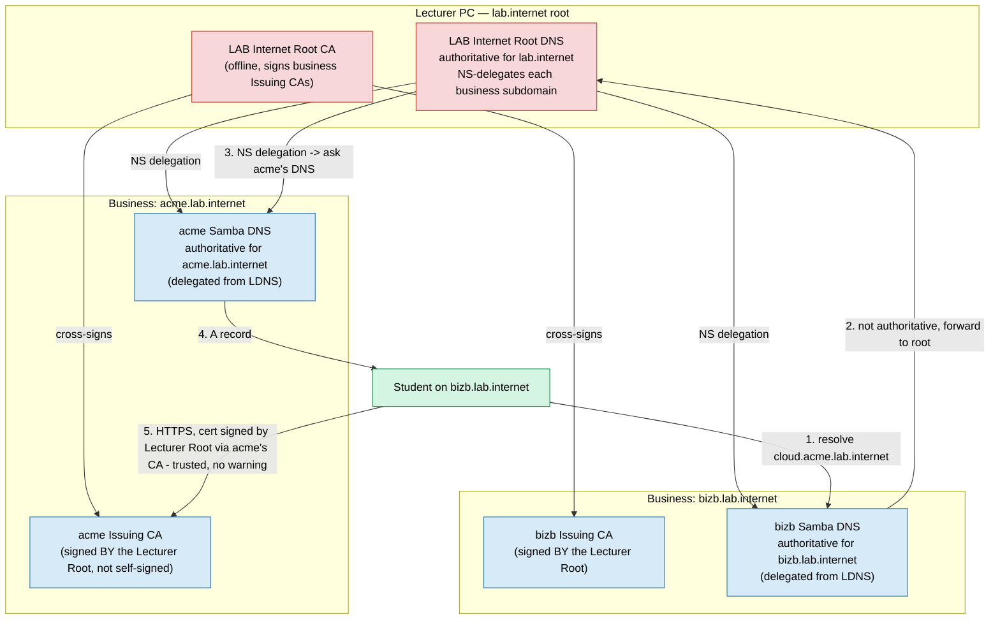

# LAB Internet (Design Doc — Skeleton, Not Yet Fully Implemented)

> **Status: design + script stubs only.** This is the capstone extension beyond
> [MultiBusiness.md](MultiBusiness.md): instead of each business trusting nothing about the
> others by default, a lecturer-run root of trust lets students browse _across_ businesses
> (`cloud.acme.lab.internet` from a `bizb.lab.internet` machine) with no per-host cert warnings
> and working cross-business DNS, while each business still runs its own AD/Authentik and
> nobody's identity domain merges with anyone else's. The scripts under
> `federation/lab-internet/scripts/` are stubs that print exactly what they will do and what
> currently blocks a full implementation — see [Implementation status](#implementation-status).
> Treat this document as the spec for that follow-up work, not as something to run today.

## Why this is separate from MultiBusiness.md

[MultiBusiness.md](MultiBusiness.md)'s IPSec/VPN model gives two businesses network
_reachability_. It deliberately does not give them shared trust or shared naming — that gap is
called out explicitly there. LAB Internet closes that gap for an entire classroom at once,
which is a fundamentally different (and larger) problem: it requires a third party (the
lecturer) that every business agrees to trust, and a naming scheme that nests businesses under
a common root — neither of which a peer-to-peer IPSec pairing needs.

## Naming scheme

Root domain: `lab.internet` (deliberately distinct from any single business's own domain).
Each business becomes a subdomain of it: `acme.lab.internet`, `bizb.lab.internet`. This means
business domains become **three** DNS labels (`acme.lab.internet`), not the two labels
`scripts/provision-business.sh` currently supports (`DC=acme,DC=lab,DC=internet` vs. today's
`DC=acme,DC=internal`) — see [Implementation status](#implementation-status) for what that
requires.

## Architecture

## What federates and what still doesn't

| Federates (LAB Internet)                                                                     | Still stays per-business                                                                                                                                                  |
| -------------------------------------------------------------------------------------------- | ------------------------------------------------------------------------------------------------------------------------------------------------------------------------- |
| Certificate trust — one Root CA every device trusts, so cross-business HTTPS has no warnings | AD/Kerberos domains — `acme`'s AD and `bizb`'s AD remain fully separate; no trust relationship, no shared users                                                           |
| DNS resolution — any business can resolve any other's hostnames                              | Authentik/SSO — each business's Authentik federates only its own AD; a `bizb` user does not get SSO into `acme`'s apps without `acme` explicitly creating them an account |
| —                                                                                            | IPSec/VPN reachability — still opt-in per pair, per [MultiBusiness.md](MultiBusiness.md); LAB Internet is trust/naming, not network routing                               |

This split is deliberate: it teaches the difference between "can resolve/verify" (PKI+DNS,
public-ish information) and "can authenticate/authorize" (AD/OIDC, which should never
casually federate across independent organisations).

## Workflow (as designed)

1. **Lecturer**: `init-lecturer-root-ca.sh` creates the LAB Internet Root CA and the root DNS
   zone for `lab.internet` (empty except NS records added as businesses onboard).
2. **Each business**: `request-subordinate-ca.sh` generates an Issuing CA CSR (instead of the
   base repo's self-signed `01-init-intermediate-ca.sh`) plus a DNS delegation request
   (business's chosen subdomain label + their Samba DC's IP, if it's reachable from the
   lecturer's network — same classroom-WAN caveat as [MultiBusiness.md](MultiBusiness.md#classroom-wan-note)).
   Sends the request file to the lecturer out-of-band.
3. **Lecturer**: `approve-business.sh` signs the CSR with the LAB Internet Root CA and adds an
   NS delegation record for the business's subdomain in the root DNS zone. Sends back the
   signed cert chain.
4. **Each business**: `install-subordinate-ca.sh` installs the lecturer-signed Issuing CA in
   place of a self-signed one, and points its Unbound/DNS forwarding at the lecturer's root DNS
   for anything outside its own zone (mirrors today's `dns forwarder` setting in
   [`samba/templates/smb.conf.j2`](../samba/templates/smb.conf.j2), just pointed at the
   lecturer instead of pfSense's default upstream).

## Implementation status

Not built yet. What's needed to turn the stubs in
[`federation/lab-internet/scripts/`](../federation/lab-internet/scripts/) into working
automation, roughly in dependency order:

1. **Three-label domain support in `provision-business.sh`.** Today's DN rewrite
   (`DC=lab,DC=internal` → `DC=<label1>,DC=<label2>`) assumes exactly two labels everywhere
   (LDAP DNs, Kerberos realm derivation, cert SANs). Supporting `acme.lab.internet` means
   generalising that to N labels. Realistically this means provisioning a business **with its
   final LAB-Internet domain name from day one** (pass `--domain acme.lab.internet` up front)
   rather than trying to rename an already-provisioned Samba AD domain in place — Samba does
   not support renaming a live domain's DNS suffix/realm after `domain provision` has run.
2. **Cross-signing workflow in `pki/scripts`.** `01-init-intermediate-ca.sh` currently signs
   the Issuing CA CSR locally against `pki/root-ca`. A LAB-Internet-aware business instead
   needs to export the CSR, get it signed by a Root CA it doesn't hold the key for, and import
   the result — mechanically similar to `federation/scripts/generate-ipsec-partner-config.sh`'s
   manifest-exchange pattern, but for X.509 CSRs/certs instead of connection parameters.
3. **DNS delegation in Samba's internal DNS.** Samba AD's DNS (`SAMBA_INTERNAL` backend) can
   hold NS records for delegated subzones via `samba-tool dns add ... NS`, but the _lecturer's_
   root DNS needs to be a separate, non-AD-integrated authoritative server (BIND9 or Unbound in
   authoritative mode — Samba's internal DNS is designed to serve one AD domain, not act as a
   generic delegating root) — this is new infrastructure, not a reuse of an existing role.
4. **Forwarder reconfiguration.** Every business's `dns forwarder` (today: pfSense) needs a
   second path for `lab.internet`-suffixed queries specifically, forwarded to the lecturer's
   root DNS rather than treated as "everything else, forward upstream." This is a conditional
   forward zone, not a blanket forwarder change — same shape as the Unbound `forward-zone`
   stanza already used in [`pfsense/config/config.xml.template`](../pfsense/config/config.xml.template),
   just with a second zone block.

None of this is architecturally risky — it's a reasonable few days of focused work, not a
redesign — but it's substantial enough that building it opportunistically alongside everything
else in this pass would have meant shipping it under-tested. The stubs below exist so the next
session has a concrete, reviewed starting point instead of a blank page.
