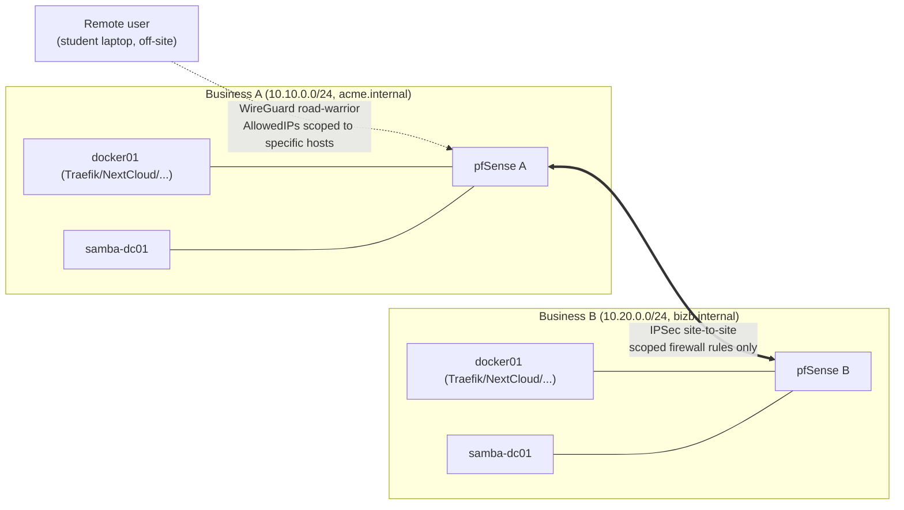

# Multi-Business Federation (IPSec Partnering + Remote Access VPN)

## Model

Each "business" is a fully independent deployment of this repository, stamped out with
[`scripts/provision-business.sh`](../scripts/provision-business.sh): its own subnet, domain,
realm, NetBIOS name, PKI (own Root + Issuing CA — never shared), and its own pfSense, AD,
Authentik, and application stack. Businesses are typically run by different student groups on
different physical hosts. Nothing connects two businesses by default — federation is an
explicit, opt-in step layered on top, using this directory's tooling.

This deliberately mirrors how real organisations connect: two independent companies with their
own IT estates choosing to interconnect for a specific business reason (a site-to-site VPN for
a partnership) or to let their own staff work remotely (a road-warrior VPN) — never a merged
network, and never blanket trust.



## Two mechanisms, two purposes

| Mechanism                          | Purpose                                                                                                                            | Trust model                                                                                                                                                                                                            |
| ---------------------------------- | ---------------------------------------------------------------------------------------------------------------------------------- | ---------------------------------------------------------------------------------------------------------------------------------------------------------------------------------------------------------------------- |
| **IPSec site-to-site**             | Business-to-business partnering — e.g. Business A's staff need to reach Business B's NextCloud to collaborate on a shared project. | Peer-to-peer between two pfSense instances. **Never** full subnet-to-subnet allow — see [Scoped firewall rules](#scoped-firewall-rules-not-full-subnet-trust) below.                                                   |
| **OpenVPN/WireGuard road-warrior** | Remote access — a single user (off-site, home, another network) reaching back into their own business.                             | One business, one remote identity. WireGuard is the default here (simpler, faster, smaller attack surface); OpenVPN instructions are noted as an alternative where WireGuard's kernel/package support isn't available. |

## Prerequisites

1. Both businesses exist as separate deployments (via `provision-business.sh`), each with a
   pfSense WAN interface reachable from the other (in a classroom, this is usually "same
   physical LAN/hypervisor network segment acting as each pfSense's WAN," not real internet —
   see [Classroom WAN note](#classroom-wan-note)).
2. Their LAN subnets **do not overlap** (`provision-business.sh` warns but does not enforce
   this across separate deployments — coordinate with your partner business's students before
   picking a subnet).
3. A secure out-of-band channel to exchange a manifest and a pre-shared key with your partner
   (Slack DM, in person, a shared drive — not committed to either repo's git history).

## Workflow: partnering two businesses via IPSec

1. Each side runs, from their own repo:

   ```bash
   ./federation/scripts/register-business.sh \
     --wan-endpoint <this pfSense's WAN-reachable IP or hostname>
   ```

   This writes `federation/registry/<your-business-name>.yaml` — your business's public
   connection manifest (domain, subnet, WAN endpoint). Send this file to your partner
   out-of-band; drop the file they send you into your own `federation/registry/`.

2. One side generates a pre-shared key and the IPSec config for both ends:

   ```bash
   ./federation/scripts/generate-ipsec-partner-config.sh \
     --local federation/registry/<your-business>.yaml \
     --peer federation/registry/<their-business>.yaml
   ```

   This prints a PSK (send it to your partner over the same secure out-of-band channel — never
   commit it to git) plus **two** sets of pfSense Phase 1 / Phase 2 field values — one for
   "your side," one for "their side" (mirrored subnets/endpoints). Each side pastes their own
   set into pfSense's **VPN > IPsec** GUI (or imports the generated XML snippet under
   **Diagnostics > Backup & Restore**, reviewing it first — see
   [pfsense/README.md](../pfsense/README.md) for why this repo treats pfSense config as
   review-then-import rather than blind-apply).

3. Both sides add the **scoped** firewall rule the script prints (see below) — not a blanket
   subnet-to-subnet allow.

4. Verify: from Business A's `docker01`, `curl -vk https://cloud.bizb.internal` should reach
   Business B's NextCloud through the tunnel, using Business B's own PKI-issued certificate
   (which Business A's hosts won't trust yet — see [Cross-business trust](#cross-business-trust-what-ipsec-does-and-does-not-give-you)).

## Scoped firewall rules, not full subnet trust

`generate-ipsec-partner-config.sh` deliberately does **not** propose "allow peer subnet to
local subnet, any port." It prompts for which specific services the partnership actually needs
(e.g. "Business A needs HTTPS to Business B's NextCloud only") and emits a rule scoped to that
destination host and port, matching the least-privilege posture in
[docs/Security.md](Security.md#firewall-recommendations-pfsense). Widen it manually and
deliberately if your exercise calls for more — don't default to open.

## Cross-business trust: what IPSec does and does not give you

IPSec gives you **network reachability** — packets can now flow between the two subnets. It
gives you **nothing** at the identity or PKI layer:

- Business A's hosts do not trust Business B's Issuing CA, so `https://cloud.bizb.internal`
  will show a certificate warning on Business A's machines until Business A's admins choose to
  add Business B's CA chain to their trust store (same mechanism as
  [docs/PKI.md](PKI.md#trust-deployment), pointed at a second CA bundle) — this is a deliberate
  teaching moment: network connectivity and certificate trust are separate decisions.
- Business A's Authentik does not federate Business B's Samba AD (and shouldn't — that would
  merge their identity domains). If the exercise calls for actual cross-business collaboration
  logins, that's what [docs/LabInternet.md](LabInternet.md)'s federated PKI/DNS model is for —
  IPSec alone deliberately stops short of that.

## Remote access: WireGuard road-warrior

```bash
./federation/scripts/generate-wireguard-roadwarrior.sh \
  --user student01 \
  --allowed-hosts 10.10.0.20/32,10.10.0.30/32
```

Generates a keypair and a client config in `federation/wireguard-clients/student01.conf` (never
committed — see [`.gitignore`](../.gitignore)) scoped via `AllowedIPs` to only the hosts the
remote user actually needs (here: the Docker app server and Authentik — not the whole `/24`,
and deliberately not the DC directly, since Kerberos/LDAP over a road-warrior VPN to a
sometimes-hostile remote network is a bigger blast radius than it's worth for this lab). The
script also prints the peer stanza to add under pfSense's **VPN > WireGuard** GUI. Import the
resulting `.conf` into the WireGuard app (desktop or mobile) on the remote device.

If your pfSense build lacks WireGuard package support, `docs/MultiBusiness.md`'s companion
script `generate-wireguard-roadwarrior.sh --openvpn` emits an equivalent OpenVPN client config
and server-side field values instead — functionally similar, larger and slower handshake,
included for completeness/comparison rather than as the recommended default.

## Classroom WAN note

In a real deployment, "WAN endpoint" means a public IP or DDNS hostname. In a single-room
classroom where every business's pfSense actually sits on the same physical switch/host
network, point `--wan-endpoint` at that shared segment's address instead, and treat it as a
teaching stand-in for the internet — the IPSec/WireGuard mechanics are identical either way,
which is the point of the exercise.

## See also

- [docs/Architecture.md](Architecture.md#domain-and-subnet-naming) — why domain/subnet/NetBIOS
  are parameterised in the first place.
- [docs/LabInternet.md](LabInternet.md) — the deferred, larger federation model (shared root
  CA + DNS delegation across businesses), for when IPSec-only connectivity isn't enough.
- [diagrams/federation-topology.md](../diagrams/federation-topology.md) — the network diagram
  above, plus the WireGuard road-warrior path.
